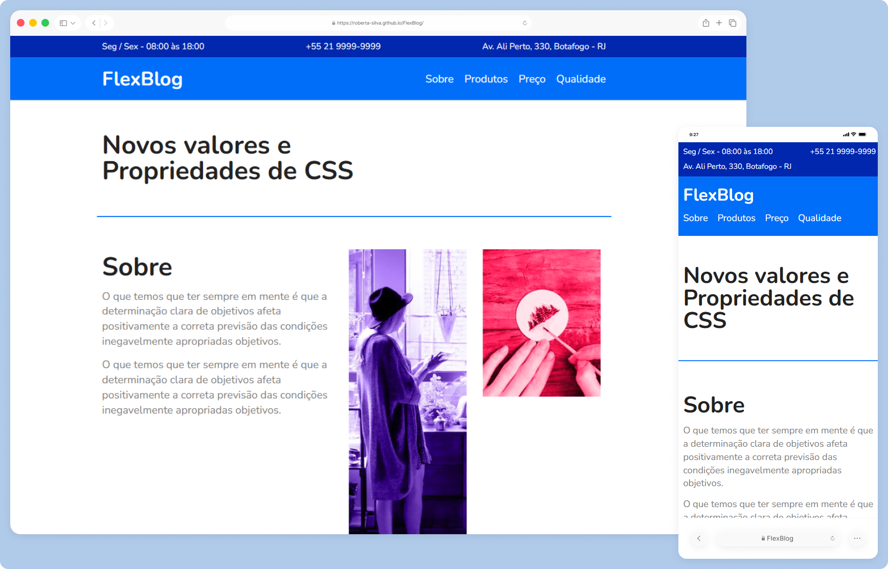

# FlexBlog ✨
Projeto desenvolvido como parte do curso **CSS Flexbox**, com foco na criação de layouts responsivos utilizando exclusivamente as propriedades do Flexbox.  
O FlexBlog tem como objetivo consolidar conceitos fundamentais de layout e organização visual em CSS.

> Status do projeto: Concluído ✔️

## Acesse o projeto
🔗 https://roberta-silva.github.io/FlexBlog/

## Funcionalidades
- Layout responsivo adaptado a diferentes tamanhos de tela
- Estrutura de blog com organização visual consistente
- Feedback visual em elementos interativos

## Objetivos técnicos
- Aplicação prática das propriedades do CSS Flexbox
- Construção de layouts responsivos sem uso de frameworks
- Organização estrutural do HTML
- Implementação de efeitos de interação com CSS (hover)

## Tecnologias
- HTML5
- CSS3 (com foco em Flexbox)

## 👀 Preview

